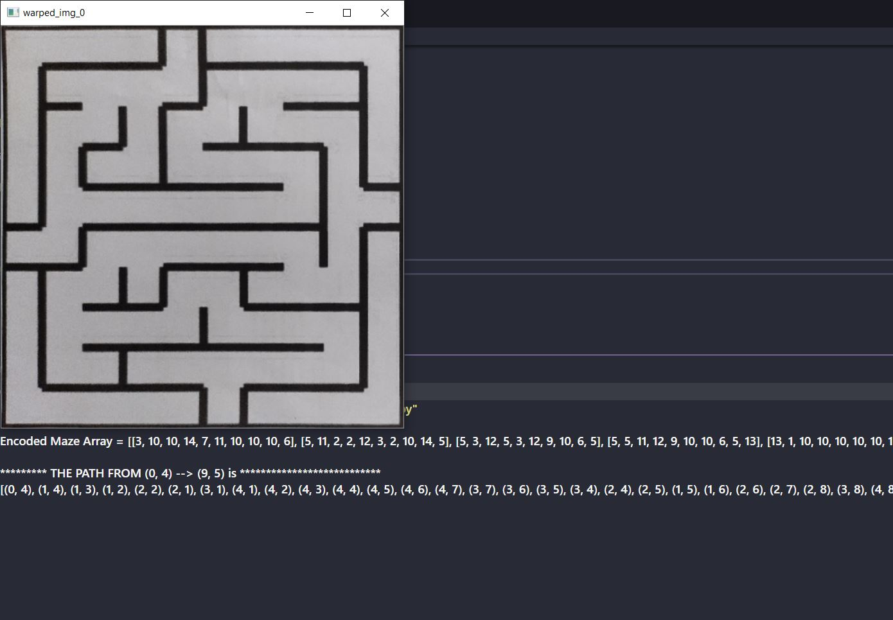

# Maze-Detector-Solver

This project makes use of OpenCV to detect and encode a Maze. Then is a graph algorithm in used to solve the detected Maze.

At first **Perspective Transform** is applied on the Maze and then maze is detected i.e encoded by using an encoding scheme in which each wall of each cell of the maze is 
considered as a power of two. That implies: left --> 2^0 top --> 2^1 right --> 2^2 and bottom --> 2^3. Hence, each cell can be presented as a number from 1 - 15.

After encoding a given maze, we have tuples of starting an ending coordinates by which **DFS** with a little modification using **Backtracking** is applied to finally get the path from
starting coordinate to the ending coordinate.

### Example output for maze00

